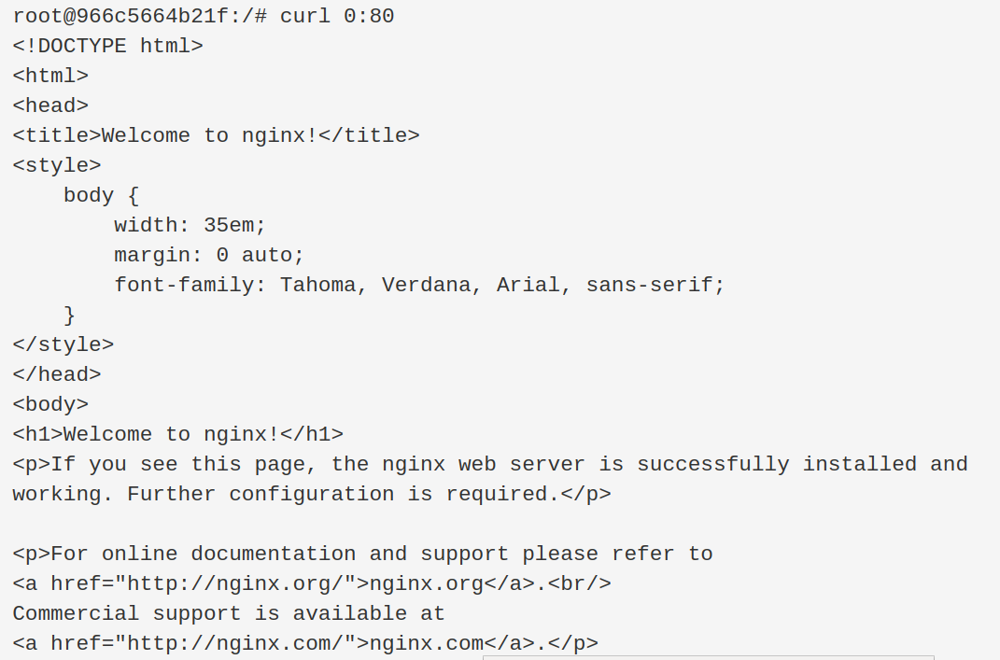

### PROJECT: 0x0E. Web stack debugging #1
----
#### For this project, we are going to learn about:
- Network basics.
- Web stack debugging.

&emsp;&emsp;
----
### Personal Review:
- we received a container with Ubuntu 14 OS, and an Nginx Webserver installed.
- when using ```curl 0:80``` on terminal, it shows message:
<br>&emsp;&emsp;"curl: (7) Failed to connect to 0 port 80: Connection refused".
- Then we must find what's happening, and solve it.

### Personal Procedural task to solve:
1) check if nginx is running:
<br>&emsp; ```service nginx status```
<br>
2) check if nginx.cnf file has syntax issues:
<br>&emsp; ```nginx -t```
<br>
3) check if for some reason there is an apache webserver previously installed:
<br>&emsp; ```sudo apache2 -v```
<br>
4) check if there is some 'ufw' (uncomplicated firewall installed or active):
<br>&emsp; ```sudo ufw -v```
<br>
5) check port status with 'netstat' command:
<br>&emsp; ```netstat -tulpn```
<br>
5a) Optional (if only want to show what's happening on port 80):
<br>&emsp; ```netstat -tulpn | grep :80```
<br>
6) Nginx <b>/etc/nginx/sites-enabled/</b> must contain ONLY a softlink to the 'default' file,
which is trully located in <b>/etc/nginx/sites-available</b> !!!
<br>
7) We found that which really was inside <b>/etc/nginx/sites-enabled</b> was a 'default' file instead of a soft link. So we proceed to delete that default file and create the soft link to the trully 'default' file, this way:
<br>&emsp;&emsp; ```sudo rm -f /etc/nginx/sites-enabled/```
<br>&emsp;&emsp; ```sudo ln -s /etc/nginx/sites-available/default /etc/nginx/sites-enabled/default```
<br>
8) Then we need to start again Nginx service:
<br>&emsp;&emsp; ```sudo service nginx start```
<br>
9) Then we do again a 'curl command' on port 80, to verify if there's http response:
<br>&emsp;&emsp; ```curl 0:80```
<br>&emsp;&emsp;
<br>
10) now everything is working ok with nginx !!!.

---
    git_user: ronniebm  /  email: ronnie.coding@gmail.com
