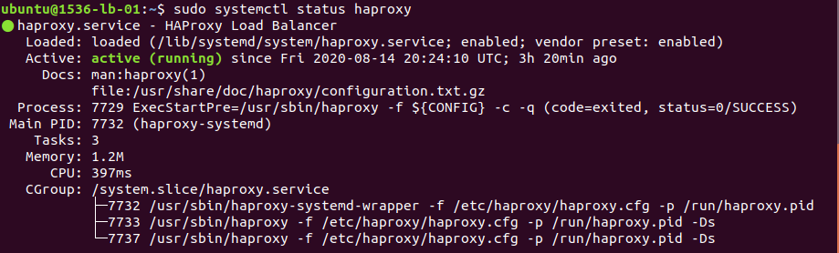
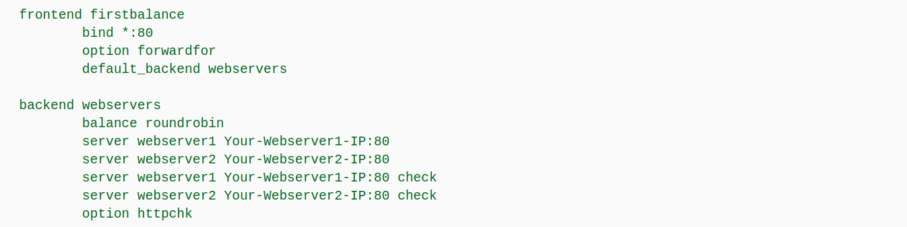

### PROJECT: 0x0F. Load balancer.  

#### 1. Topics to be learned:nginx-
- Load balancer.
- Web stack debugging.

#### 2. Given Resources:
- 1536-web-01 [Web server #1] ----- ubuntu 16.04 LTS.
- 1536-web-02 [Web server #2] ----- ubuntu 16.04 LTS.
- 1536-lb-01  [Load Balancer] ----- ubuntu 16.04 LTS.

#### 3. Mandatory Tasks to be completed:  
0. Duplicate webservers configuration.  
1. Install a load balancer [HAproxy].  

### My personal Issues during deployment (REVIEW):  
When i run the script of previous project (task4) my <b>nginx</b>.  
web server was having issues to start, i'd reinstalled this way:  

1. execute this command to erase ALL about nginx:  
&emsp; ```sudo apt-get purge nginx nginx-common```  

2. Optioal (only if step 1. doesn't work):
&emsp; ```sudo apt-get remove nginx-core nginx-full nginx-light nginx-extra nginx-naxsi nginx-common```  

For install the 'HAproxy' load balancer:
&emsp; ```sudo apt update```  
&emsp; ```sudo apt-get -y install haproxy```  

After HAproxy installation, we must verify that is working:
&emsp; ```sudo systemctl status haproxy```

<p align="left">&emsp; </p>

Remember, The HAproxi config file is located in directory:  
&emsp;&emsp;<b>/etc/haproxy/haproxy.cfg </b>

Open the haproxy.cfg and you will find two sections called:  

- global ----- It contains config. of HAproxy Itself (parameters indented).  
- defaults --- It contains default values of HAproxy behavior (indented).  

<p align="left">&emsp; </p>